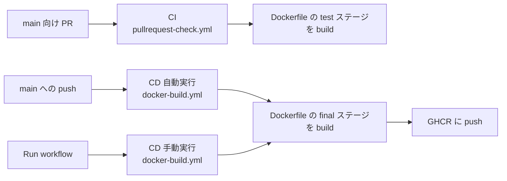
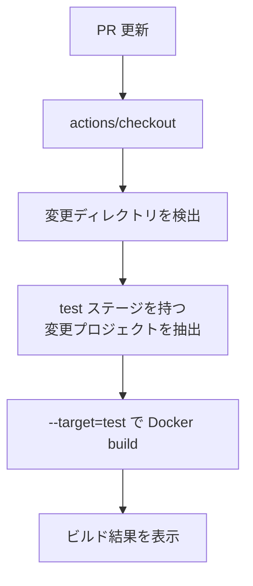
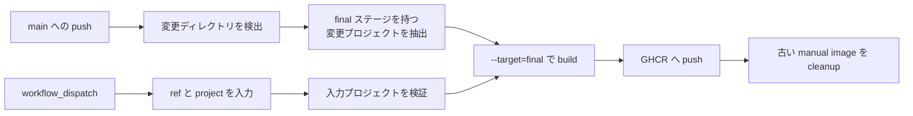
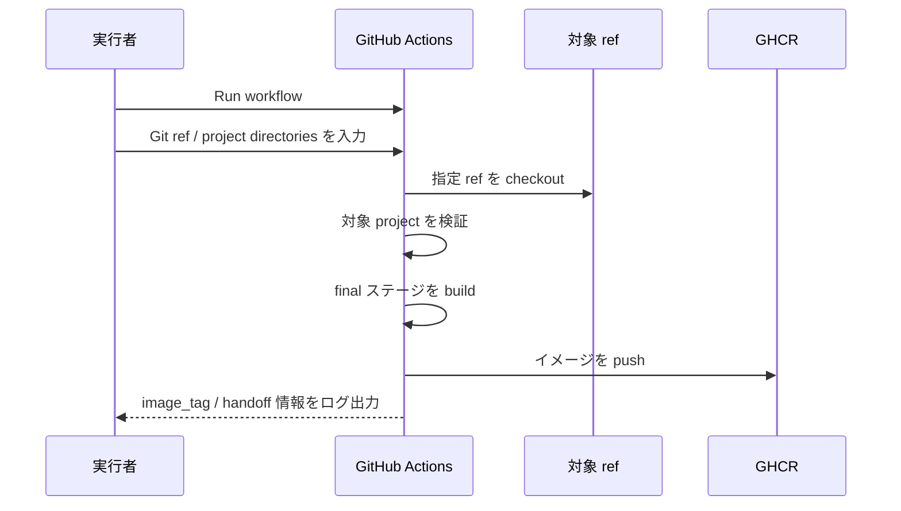
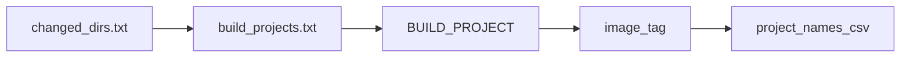

# CI/CDについて

## まず全体像

このリポジトリでは GitHub Actions を使って、`projects/` 配下の Docker 対応プロジェクトを CI と CD で扱います。

- CI は PR 上で `test` ステージを検証します。
- CD は `final` ステージのイメージを GHCR に push します。
- CD は `main` への push で自動実行でき、任意の ref / project を指定した手動実行にも対応しています。



## どちらが何をするか

| 項目 | CI | CD |
|---|---|---|
| Workflow | `pullrequest-check.yml` | `docker-build.yml` |
| 主なトリガー | `main` 向け PR | `main` への push / manual run |
| 対象ステージ | `test` | `final` |
| 目的 | 変更の検証 | 配布用イメージの作成と push |
| 成果物 | ビルド結果の確認 | GHCR イメージ |

## 対象になるプロジェクト

対象は `projects/` 配下にあり、次の条件を満たすディレクトリです。

- ルートに `Dockerfile` がある
- CI の対象にするには `test` ステージがある
- CD の対象にするには `final` ステージがある

```dockerfile
FROM base AS test
RUN ./run-tests.sh

FROM base AS final
COPY . .
CMD ["./start.sh"]
```

- `test` ステージだけを持つプロジェクトは CI 専用として扱えます。
- `final` ステージを持たないプロジェクトは CD の対象になりません。

## CI

### いつ動くか

- `main` 向け PR の作成・更新時に実行されます。
- 対象は `projects/` 配下の変更です。

### 何をするか



### 見るポイント

- PR で失敗した場合、まず `test` ステージが存在するか確認します。
- CI は push しません。検証だけを行います。

## CD

### 自動実行と手動実行



### 自動実行

- `main` への push 時に実行されます。
- 対象は `projects/` 配下の変更です。
- `final` ステージを持つプロジェクトだけが build / push されます。

### 手動実行

`docker-build.yml` は `workflow_dispatch` に対応しています。通常のテスト build では GitHub Actions の `Run workflow` からそのまま起動します。



入力時の見方は次のとおりです。

- `Use workflow from` は通常 `main` のままで問題ありません。
- `Git ref (branch/tag/SHA)` に build したい branch / tag / commit を入力します。
- `Comma separated project directories` に `projects/portal` のようなディレクトリを入力します。
- 手動実行時の build stage は常に `final` です。
- 手動実行時の manual image cleanup は常に最新 `3` 件を残します。

手動 build 完了後のログには、次の deploy handoff 用の値が表示されます。

- `image_tag=<generated-tag>`
- `target=<project-name> image_tag=<generated-tag>`

### CD の処理順

1. 対象 ref を checkout する
2. 自動実行では変更ディレクトリを検出する
3. build 対象プロジェクトを `build_projects.txt` に確定する
4. `--target=final` で Docker build を実行する
5. `ghcr.io/{repo}/{project}:{image_tag}` へ push する
6. 古い manual image を含む不要イメージを cleanup する

## カスタムアクション

### 役割の対応表

| アクション | 役割 | 主な出力 |
|---|---|---|
| `get-changed-directories` | 差分から `projects/` 配下の変更ディレクトリを拾う | `changed_dirs.txt` |
| `get-changed-projects` | 必要な Docker stage を持つ project を絞り込む | `build_projects.txt`, `BUILD_PROJECT` |
| `prepare-manual-build-inputs` | 手動実行で指定された project を検証する | `build_projects.txt`, `BUILD_PROJECT` |
| `set-image-tag` | 実行種別に応じた tag を決める | `image_tag` |
| `build-docker-images` | Docker image を build する | build 結果 |
| `push-docker-images` | GHCR に push する | `project_names_csv` |
| `cleanup-docker-images` | 古い image を cleanup する | cleanup 結果 |

### 各アクションの詳細

#### `get-changed-directories`

- 入力: `HEAD` と比較対象 ref の差分
- 対象: `projects/` 配下
- 出力: `changed_dirs.txt`

#### `get-changed-projects`

- 入力: `changed_dirs.txt`
- オプション: `required-stage`
- 出力: `build_projects.txt`, `BUILD_PROJECT`

`required-stage` が指定された場合、そのステージを持つ Dockerfile だけが対象になります。

#### `prepare-manual-build-inputs`

- 入力: `projects`
- 出力: `build_projects.txt`, `BUILD_PROJECT`

手動実行用です。指定されたプロジェクトに `Dockerfile` と `final` ステージがあることを確認します。

#### `set-image-tag`

- push 実行時は `latest`
- 手動実行時は `manual-<sanitized-ref>-<short-sha>`

#### `build-docker-images`

- 入力: `stage`, `image_tag`

補足:

- `COMMIT_HASH` を build arg として渡します。
- `pre-docker-build.sh` があれば build 前に実行します。

#### `push-docker-images`

- 入力: `username`, `password`, `image_tag`
- 出力: `project_names_csv`

push 成功時は、対象プロジェクト名と deploy handoff 用の `target=... image_tag=...` をログに出します。

#### `cleanup-docker-images`

- 入力: `token`, `repo-name`, `project-names-csv`, `keep-count`

CD 実行後、不要な古いイメージの cleanup を行います。manual build では `keep-count=3` が使われます。

## データの受け渡し



主に `build_projects.txt` と step output を使って、build 対象と push 対象を次の step に渡します。

## トラブルシューティング

### ビルド対象が見つからない

- 対象が `projects/` 配下か確認する
- Dockerfile がプロジェクトルートにあるか確認する
- CI では `test`、CD では `final` ステージがあるか確認する

### 手動 build で意図した ref が使われない

- `Use workflow from` ではなく `Git ref (branch/tag/SHA)` を確認する
- `Use workflow from` は通常 `main` のままでよい

### push に失敗する

- `PRIVATE_REPO_TOKEN` が正しいか確認する
- `write:packages` 権限があるか確認する
