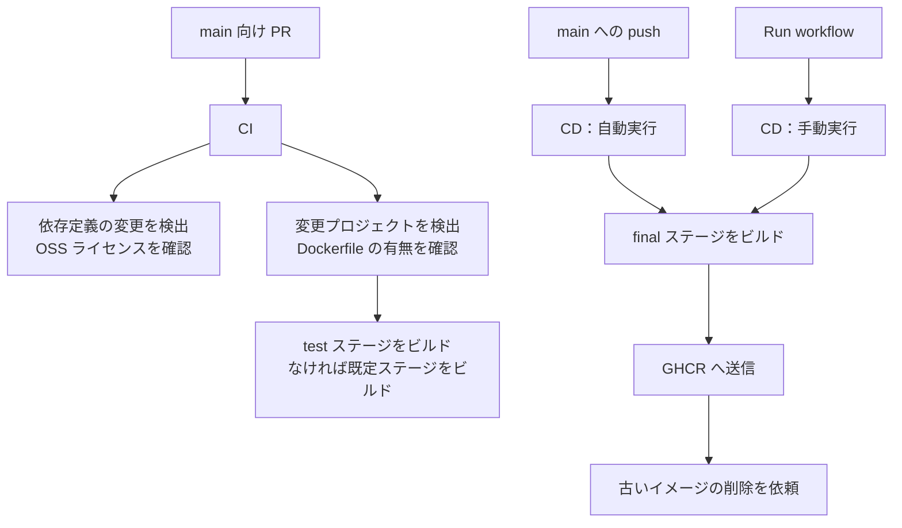

# CI/CD の仕組みと運用

このリポジトリでは、GitHub Actions を使って `projects/` 配下の Docker 対応プロジェクトを検証し、配布用イメージを GitHub Container Registry（GHCR）へ送信します。

- **CI** は `main` 向けのプルリクエスト（PR）で動き、OSS ライセンスと Docker ビルドを検証します。
- **CD** は `main` への push または手動操作で動き、`final` ステージのイメージを GHCR へ送信します。
- デプロイ先の定義は、このリポジトリでは管理しません。CD の責務は、イメージの送信と古いイメージの削除依頼までです。

## CI と CD の違い

| 項目 | CI | CD |
| --- | --- | --- |
| ワークフロー | `.github/workflows/pullrequest-check.yml` | `.github/workflows/docker-build.yml` |
| 起動条件 | `main` 向け PR の作成・更新 | `main` への push、または手動実行 |
| 主な目的 | 変更内容の検証 | 配布用イメージの作成と送信 |
| Docker の対象 | `test` ステージ。存在しない場合は既定ステージ | `final` ステージがあるプロジェクトのみ |
| レジストリへの送信 | しない | GHCR へ送信する |
| イメージタグ | `latest`（ローカルのビルド結果のみ） | 自動実行は `latest`、手動実行は生成タグ |


```mermaid
flowchart TB
  PR["main 向け PR"] --> CI["CI"]
  CI --> LICENSE["依存定義の変更を検出<br/>OSS ライセンスを確認"]
  CI --> CI_PROJECTS["変更プロジェクトを検出<br/>Dockerfile の有無を確認"]
  CI_PROJECTS --> CI_BUILD["test ステージをビルド<br/>なければ既定ステージをビルド"]

  PUSH["main への push"] --> AUTO["CD：自動実行"]
  MANUAL["Run workflow"] --> MANUAL_CD["CD：手動実行"]
  AUTO --> FINAL["final ステージをビルド"]
  MANUAL_CD --> FINAL
  FINAL --> GHCR["GHCR へ送信"]
  GHCR --> CLEANUP["古いイメージの削除を依頼"]
```

## ビルド対象の決まり方

変更ファイルから、次のマーカーファイルを持つ最寄りのディレクトリをプロジェクトルートとして検出します。

- `package.json`
- `pyproject.toml`
- `Dockerfile`
- `go.mod`
- `Cargo.toml`
- `Makefile`
- `docker-compose.yaml` または `docker-compose.yml`

検出対象は `projects/` 配下です。`projects/<name>`、`projects/_labs/<name>`、`projects/_samples/<name>` の直下にマーカーファイルがある場合は、そのディレクトリを優先します。

CI と CD では、検出後の絞り込み条件が異なります。

| 実行経路 | Docker ビルドの対象 |
| --- | --- |
| CI | 変更プロジェクトのうち、ルートに `Dockerfile` があるもの |
| CD：自動実行 | 上記に加え、`Dockerfile` に `final` ステージがあるもの |
| CD：手動実行 | 入力した各ディレクトリに `Dockerfile` と `final` ステージがあるもの |

Dockerfile の基本形は次のとおりです。

```dockerfile
FROM base AS test
RUN ./run-tests.sh

FROM base AS final
COPY . .
CMD ["./start.sh"]
```

CI は `test` ステージを指定してビルドします。ただし、現在のビルドスクリプトは `test` ステージがない場合にターゲット指定を外し、Dockerfile の既定ステージをビルドします。
一方、CD は対象検出の時点で `final` ステージの有無を確認するため、`final` ステージがないプロジェクトを送信しません。

## CI：PR の変更を検証する

### 起動条件

`main` 向け PR の作成・更新時に `.github/workflows/pullrequest-check.yml` が起動します。
ワークフロー自体にはパスの絞り込みがないため、`docs/` だけを変更した PR でも起動しますが、対象がなければライセンスの実スキャンと Docker ビルドは行いません。

同じ PR で新しい実行が始まると、進行中の古い実行はキャンセルされます。

### 処理順

1. PR のベースブランチを取得する
2. 変更ファイルからプロジェクトルートを検出し、`changed_dirs.txt` に保存する
3. 依存定義の変更からライセンスチェック対象を検出する
4. 対象があれば OSS ライセンスを確認する
5. `Dockerfile` がある変更プロジェクトを `build_projects.txt` に保存する
6. 各プロジェクトを `stage=test` でビルドする
7. ビルド済み Docker イメージをログに表示する

ライセンスチェックの対象や判定方法は、[OSS ライセンスチェック](./license-check.md)を参照してください。

### 失敗時に確認する箇所

- ライセンスチェックで失敗した場合は、ログの `reason_code` と対象パッケージを確認する
- Docker ビルドで失敗した場合は、検出されたプロジェクトと `Dockerfile` のステージ名を確認する
- テストが実行されていない場合は、`Dockerfile` に `AS test` があるか確認する

## CD：イメージを GHCR へ送信する

### 自動実行

`main` への push で `.github/workflows/docker-build.yml` が起動します。

1. 直前のコミットとの差分から変更プロジェクトを検出する
2. `final` ステージがあるプロジェクトだけを選ぶ
3. `final` ステージを `latest` タグでビルドする
4. `ghcr.io/<owner>/<repository>/<project>:latest` へ送信する
5. 送信したプロジェクトを対象に、古いイメージの削除を依頼する

CD は同じブランチの実行を直列に処理し、後続の push があっても進行中の実行をキャンセルしません。

### 手動実行

任意のブランチ、タグ、コミットをビルドしたい場合は、GitHub Actions から `docker-build.yml` を手動実行します。

1. GitHub Actions で **CD** を開き、**Run workflow** を選ぶ
2. **Use workflow from** は通常 `main` のままにする
3. **Git ref (branch/tag/SHA)** に、ビルドするブランチ名・タグ・コミットハッシュのいずれかを入力する
4. **Comma separated project directories** に、`projects/portal` のようなプロジェクトディレクトリを入力する
5. 複数指定する場合は、`projects/portal,projects/portfolio` のようにカンマで区切る

手動実行では、指定したすべてのプロジェクトに `Dockerfile` と `final` ステージが必要です。一つでも条件を満たさない場合は、ビルド前に失敗します。

### イメージタグ

| 実行方法 | タグ |
| --- | --- |
| `main` への push | `latest` |
| 手動実行 | `manual-<sanitized-ref>-<short-sha>` |

手動実行のタグでは、入力した ref を小文字へ変換し、タグに使えない文字を `-` へ置換します。完了ログには、デプロイ側へ渡す値が次の形式で表示されます。

```text
image_tag=<generated-tag>
image_path=monorepo/<project-name> image_tag=<generated-tag>
```

## 古いイメージの削除依頼

GHCR への送信後、`cleanup-docker-images` アクションが `repository_dispatch` を送ります。現行の通知先は `u7chan/self-hosted-runner` です。送信先では、各プロジェクトの新しいイメージを `3` 件残す設定です。

```json
{
  "event_type": "deploy_local_trigger",
  "client_payload": {
    "image_path": "monorepo/portfolio,monorepo/u7chat",
    "keep_count": "3",
    "cleanup_mode": "normal"
  }
}
```

- `image_path` は `monorepo/<project-name>` のカンマ区切りです。
- `cleanup_mode` は、自動実行では `normal`、手動実行では `manual` です。
- この通知はデプロイを指示するものではなく、GHCR に保持するイメージ数の整理を依頼します。

## カスタムアクションの役割

| アクション | 入力 | 主な出力・成果物 |
| --- | --- | --- |
| `get-changed-directories` | Git の差分 | `changed_dirs.txt` |
| `get-license-check-targets` | Git の差分 | `license_check_targets.txt`、`LICENSE_CHECK_TARGETS` |
| `get-changed-projects` | `changed_dirs.txt`、任意の `required-stage` | `build_projects.txt`、`BUILD_PROJECT` |
| `prepare-manual-build-inputs` | `projects` | 検証済みの `build_projects.txt`、`BUILD_PROJECT` |
| `set-image-tag` | イベント名、手動実行の ref | `image_tag` |
| `build-docker-images` | `stage`、`image_tag` | ビルド済み Docker イメージ |
| `push-docker-images` | 認証情報、`image_tag` | GHCR イメージ、`project_names_csv` |
| `cleanup-docker-images` | `project-names-csv`、保持数、実行モードなど | 削除処理を始める `repository_dispatch` |

`build-docker-images` は、現在の短縮コミットハッシュを `COMMIT_HASH` ビルド引数として渡します。プロジェクトルートに `pre-docker-build.sh` がある場合は、Docker ビルドの前に実行します。

## トラブルシューティング

### ビルド対象が空になる

1. 変更ファイルが `projects/` 配下にあるか確認する
2. プロジェクトルートにマーカーファイルがあるか確認する
3. プロジェクトルートに `Dockerfile` があるか確認する
4. CD の場合は、`Dockerfile` に `AS final` があるか確認する

### 手動実行で意図した ref を使えない

ビルド対象のソースは **Use workflow from** ではなく、**Git ref (branch/tag/SHA)** の入力値で決まります。入力した ref がリポジトリに存在するか、綴りを含めて確認してください。

### GHCR への送信に失敗する

- `PRIVATE_REPO_TOKEN` が設定されているか確認する
- トークンで GHCR へログインし、イメージを送信できるか確認する
- ログに表示されたイメージ URI とタグが、ビルド時の値と一致しているか確認する

### 古いイメージの削除が始まらない

- `PRIVATE_REPO_NAME` が通知先リポジトリを指しているか確認する
- `PRIVATE_REPO_TOKEN` で通知先リポジトリへアクセスできるか確認する
- `push-docker-images` の `project_names_csv` が空でないか確認する
- `cleanup-docker-images` のログに `Cleanup trigger sent successfully.` があるか確認する
