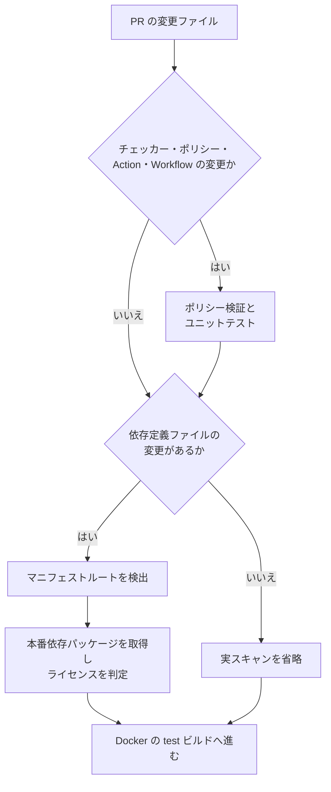

# OSS ライセンスチェック

このリポジトリでは、Node.js と Python の本番依存パッケージを対象に OSS ライセンスを確認します。PR の検証結果は GitHub Actions のログへ出力し、アーティファクトには保存しません。

チェック結果は次の3段階です。

| 結果 | CI | 意味 |
| --- | --- | --- |
| `PASS` | 成功 | 許可済みのライセンス、または依存パッケージなし |
| `WARN` | 成功 | 個別確認が必要、ライセンス不明、または式を判定できない |
| `FAIL` | 失敗 | 禁止ライセンス、未対応の構成、または依存関係の取得失敗 |

`FAIL` が1件でもあれば終了コードは `1` になります。`WARN` だけであれば CI は継続します。

## まずローカルで確認する

単一の対象を確認するには、リポジトリルートで次を実行します。

```bash
./scripts/check-licenses --target projects/portfolio
```

複数の対象はカンマで区切ります。

```bash
./scripts/check-licenses --targets projects/portfolio,projects/edit-vid/frontend
```

結果を JSON ファイルにも保存する場合は、`--json-output` を追加します。

```bash
./scripts/check-licenses \
  --target projects/portfolio \
  --json-output /tmp/portfolio-license-report.json
```

## チェック対象

### 対象の単位

チェック対象は Docker プロジェクトのルートではなく、依存定義ファイルがある**マニフェストルート**です。一つのプロジェクト内に複数のマニフェストがあれば、それぞれを別の対象として扱います。

```text
projects/edit-vid/           # Python のマニフェストルート
projects/edit-vid/frontend/  # Node.js のマニフェストルート
```

pnpm workspace は例外です。親に `pnpm-workspace.yaml` と `pnpm-lock.yaml` があり、lockfile の `importers` に登録されている子マニフェストは、親を対象にまとめて一度だけスキャンします。CLI の `--target`、`--all-targets` と PR の対象検出で同じ判定を使います。子が独立したlockfileを持つ場合や、importerとして未登録の場合は統合しません。対象は pnpm が生成する標準形式のlockfileです。

### PR で実スキャンを始める変更

PR の CI では、`projects/` 配下にある次のファイルが変わったマニフェストルートだけを実スキャンします。

- `package.json`
- `bun.lock`
- `bun.lockb`
- `package-lock.json`
- `pnpm-lock.yaml`
- `pnpm-workspace.yaml`
- `pyproject.toml`
- `uv.lock`

README、`docs/`、アプリケーションコードだけの変更では実スキャンしません。

### 対応するパッケージ管理

| エコシステム | 必要なロックファイル | 依存関係の取得コマンド |
| --- | --- | --- |
| Node.js / Bun | `bun.lock` または `bun.lockb` | `bun install --frozen-lockfile --production --ignore-scripts` |
| Node.js / npm | `package-lock.json` | `npm ci --omit=dev --ignore-scripts --no-audit --no-fund` |
| Node.js / pnpm | `pnpm-lock.yaml` | `pnpm install --frozen-lockfile --prod --ignore-scripts` |
| Python / uv | `uv.lock` | `uv sync --frozen --no-dev --no-install-project --no-install-workspace --python <version>` |

ロックファイルが複数ある場合は、Bun、npm、pnpm の順に判定します。

次の構成には対応していません。

- Yarn
- 依存パッケージがあるにもかかわらず、対応する Node.js ロックファイルがない構成
- `requirements.txt`、Poetry、Pipenv
- `uv.lock` がない Python プロジェクト

未対応の構成は `FAIL NOT_SUPPORTED` になります。Node.js の依存パッケージが一つも定義されていない場合は、ロックファイルがなくても `PASS NO_DEPENDENCIES` です。

## 実行環境

ローカル環境と GitHub Actions のランナーには、次のコマンドが必要です。

- Python 3.11 以上
- `bun`
- `npm`
- `pnpm`
- `uv`

`scripts/check_licenses.py` 自体は Python の標準ライブラリだけで動作します。依存パッケージのメタデータを収集するときに、対象に応じて `bun`、`npm`、`pnpm`、`uv` を外部コマンドとして実行します。

Python のバージョンは、対象ディレクトリの `.python-version` を優先します。利用できる指定がなければ、`pyproject.toml` の `requires-python` をもとに選びます。
PR の CI では、`oven-sh/setup-bun@v2` と `astral-sh/setup-uv@v6` を使って Bun と uv を準備します。pnpm は、検出した対象に `pnpm-lock.yaml` がある場合だけ `pnpm/action-setup@v4`（バージョン 10 系）で準備します。

## 判定ポリシー

判定ルールは `scripts/license-policy.json` で管理します。現在の基本ルールは次のとおりです。

| 区分 | ライセンス |
| --- | --- |
| `allowed` | `MIT`、`Apache-2.0`、`BSD-*`、`ISC`、`0BSD`、`Unlicense`、`Python-2.0`、`BlueOak-*`、`MPL-2.0` |
| `review` | `LGPL-*`、`MPL-1.*`、`EPL-*`、`CDDL-*` |
| `denied` | `AGPL-*`、`GPL-*`、`SSPL-*`、`Commons Clause` |

MPL-2.0 は通常の依存・ビルドツール利用を許可する。MPL 対象コードを改変して配布する場合や、MPL 対象物を成果物として再配布する場合は個別に確認する。

ポリシーを編集したら、構文と必須項目を検証します。

```bash
./scripts/check-licenses --validate-policy
```

### 個別の判定を上書きする

パッケージ単位の例外は `overrides` に追加します。少なくとも `ecosystem`、`name`、`status`、`reason`、`reviewed_at` が必要です。特定バージョンだけを対象にする場合は `version` も指定します。

```json
{
  "ecosystem": "npm",
  "name": "some-package",
  "version": "1.2.3",
  "status": "allowed",
  "license": "MIT",
  "reason": "Reviewed manually on 2026-05-24",
  "reviewed_at": "2026-05-24"
}
```

`reason` と `reviewed_at` を省略した例外は、ポリシー検証で失敗します。

## SPDX 式の扱い

厳密な SPDX パーサーは使わず、標準ライブラリで式を簡易判定します。

| 式 | 判定 |
| --- | --- |
| `A OR B` | どれか一つが `allowed` なら `PASS` |
| `A AND B` | すべて `allowed` なら `PASS` |
| `A AND B` に `review` を含む | `WARN` |
| `A AND B` に `denied` を含む | `FAIL` |
| 不明・複雑・解析不能な式 | `WARN` |

## ログを読む

ログには絵文字を使わず、`status` と `reason_code` を固定の英字で出力します。

| `status` | `reason_code` | 確認内容 |
| --- | --- | --- |
| `PASS` | `LICENSE_ALLOWED` | ポリシーで許可されている |
| `PASS` | `NO_DEPENDENCIES` | Node.js の依存パッケージが定義されていない |
| `WARN` | `LICENSE_REVIEW_REQUIRED` | 手動確認が必要なライセンス |
| `WARN` | `LICENSE_UNKNOWN` | ライセンスを特定できない |
| `WARN` | `EXPRESSION_UNSUPPORTED` | ライセンス式を判定できない |
| `FAIL` | `LICENSE_DENIED` | ポリシーで禁止されている |
| `FAIL` | `NOT_SUPPORTED` | マニフェストまたはロックファイルの構成が未対応 |
| `FAIL` | `INSTALL_FAILED` | パッケージ管理コマンドの実行に失敗した |

各対象の末尾には、確認したパッケージ数と `pass`、`warn`、`fail` の件数が表示されます。全対象の結果は最後の `License check summary` で確認できます。

## PR の CI で行うこと



ライセンスチェックの仕組みに関わる次のファイルが変わった場合は、ポリシー検証とユニットテストも実行します。

- `scripts/check-licenses`
- `scripts/check_licenses.py`
- `scripts/license-policy.json`
- `scripts/tests/test_check_licenses.py`
- `.github/actions/get-license-check-targets/` 配下
- `.github/workflows/pullrequest-check.yml`

仕組みを変更しただけでは、全対象の実スキャンは行いません。

## 仕組みを変更したときの検証

ポリシー、チェッカー、対象検出を変更した場合は、次の順に確認します。

```bash
./scripts/check-licenses --validate-policy
python3 -m unittest discover scripts/tests -p 'test_check_licenses.py'
./scripts/check-licenses --all-targets
```

`--all-targets` はローカルで全マニフェストルートを確認するためのオプションです。依存関係の取得を伴うため、PR の CI では実行しません。

CI と同じ対象ファイルを使って再現する場合は、次を実行します。

```bash
./scripts/check-licenses --changed-targets-file license_check_targets.txt
```

## 失敗を調べる

### `LICENSE_DENIED`

ログにあるパッケージ名、バージョン、ライセンスを確認します。利用可否を個別に判断した場合だけ、理由と確認日を付けて `overrides` に記録します。

### `NOT_SUPPORTED`

対象ディレクトリに、対応するマニフェストとロックファイルがそろっているか確認します。未対応のパッケージ管理ツールを使っている場合は、チェッカー側の対応が必要です。

### `INSTALL_FAILED`

ログに表示された `bun install`、`npm ci`、`pnpm install`、`uv sync` のエラーを確認します。ロックファイルとマニフェストの不整合、必要なランタイム、パッケージ取得時の認証を切り分けます。

### `LICENSE_UNKNOWN` または `EXPRESSION_UNSUPPORTED`

CI は成功しますが、ログに残ったパッケージのライセンス情報またはライセンス式を手動で確認します。
