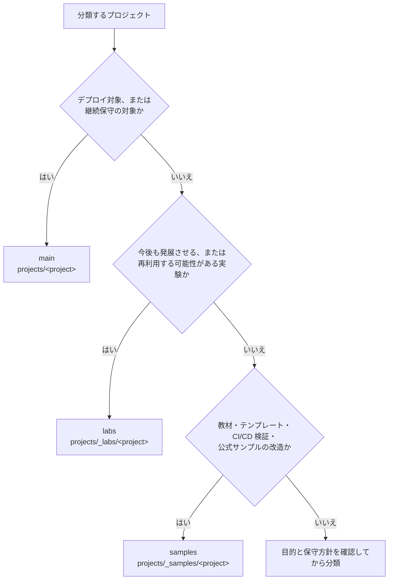

# `projects/` の分類ルール

この文書は、新しいプロジェクトの配置先を決めるとき、または既存プロジェクトを整理するときの判断基準です。技術分野や実装方式ではなく、**保守・利用の目的**で分類します。

## 配置先は3種類

| 分類 | 配置先 | 判断基準 |
| --- | --- | --- |
| `main` | `projects/<project>` | デプロイ対象、または継続して保守するアプリケーション・ライブラリ |
| `labs` | `projects/_labs/<project>` | 今後も発展させる、または再利用する可能性がある実験・PoC |
| `samples` | `projects/_samples/<project>` | 教材、テンプレート、CI/CD の検証、公式サンプルの改造 |

`main` には専用のカテゴリディレクトリを作らず、`projects/` 直下へ配置します。`poc` はプロジェクトの状態を表す言葉として使えますが、独立した配置カテゴリにはしません。

```text
projects/
├── <project>/           # main：デプロイ対象、または継続保守
├── _labs/
│   └── <project>/       # labs：発展・再利用を見込む実験や PoC
└── _samples/
    └── <project>/       # samples：教材、テンプレート、検証用
```

## 分類の判断順



迷った場合は、次の順に問い直します。

1. 現在デプロイしている、または継続保守すると決めているか
2. 実験段階でも、今後の発展や再利用を見込んでいるか
3. 成果物の主目的が教材・テンプレート・動作検証か

`Dockerfile` に `final` ステージがあることだけでは、`main` の根拠になりません。CI/CD の検証用やテンプレート用に配布可能なイメージを作る場合もあるため、プロジェクトの用途を優先します。

## ディレクトリ階層

カテゴリ配下の階層は、プロジェクト名までに限定します。

```text
projects/<project>
projects/_labs/<project>
projects/_samples/<project>
```

たとえば、`projects/_labs/frontend/<project>` のような技術分野別の中間階層は作りません。分類だけでは表せない技術分野や用途は、各プロジェクトの README に記録します。

## 判断時のチェックリスト

- 配置理由を「使用技術」ではなく「保守・利用の目的」で説明できる
- `main` の場合は、デプロイまたは継続保守の対象である
- `labs` の場合は、今後の発展または再利用の可能性がある
- `samples` の場合は、教材・テンプレート・検証という目的が明確である
- `_labs/` または `_samples/` の下に中間カテゴリを追加していない
- PoC であることだけを理由に、独自の `poc/` カテゴリを作っていない
