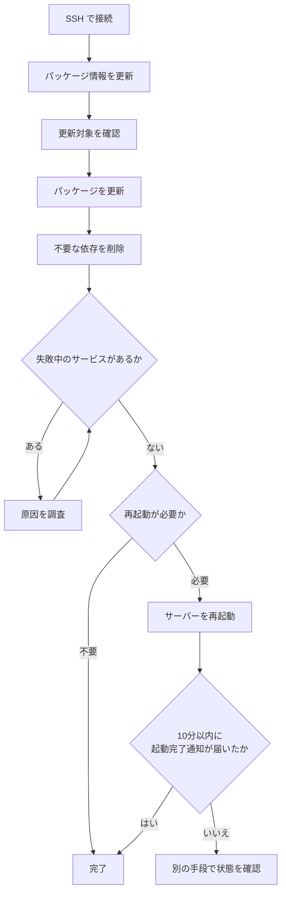

# 自宅サーバーのパッケージ更新手順

この手順は、自宅サーバーへ SSH で接続し、APT パッケージの更新から再起動確認までを行うためのものです。再起動後は、Discord の `monitor` チャンネルに届く起動完了通知を確認します。

## 作業前に確認すること

- SSH でサーバーへ接続できる
- 再起動後に SSH で接続できない場合に備え、コンソールなど別の確認手段を利用できる
- 必要であれば、手動で電源を操作できる



## 更新する

### 1. サーバーへ接続する

SSH で対象サーバーへ接続します。以降のコマンドは、接続先のサーバーで実行してください。

### 2. パッケージ情報を更新する

```sh
sudo apt update
```

### 3. 更新対象を確認する

```sh
sudo apt list --upgradable
```

表示されたパッケージを確認します。更新して問題ないことを確認できたら、次へ進みます。

### 4. パッケージを更新する

```sh
sudo apt upgrade -y
```

### 5. 不要になった依存パッケージを削除する

```sh
sudo apt autoremove -y
```

## サーバーの状態を確認する

### 6. 失敗中のサービスを確認する

```sh
systemctl list-units --failed
```

失敗しているサービスが表示された場合は、再起動へ進む前に原因を調査します。

### 7. 再起動の要否を確認する

```sh
ls /var/run/reboot-required 2>/dev/null && echo "再起動が必要です" || echo "再起動は不要です"
```

`再起動は不要です` と表示された場合は、ここで作業完了です。`再起動が必要です` と表示された場合だけ、次へ進みます。

## 必要な場合だけ再起動する

### 8. サーバーを再起動する

```sh
sudo reboot
```

SSH 接続が切れたら、Discord の `monitor` チャンネルを確認します。起動完了通知が届けば、再起動は完了です。

## 起動完了通知が届かない場合

再起動から10分経っても `monitor` チャンネルに通知が届かない場合は、サーバーで異常が発生している可能性があります。

1. コンソールなど、SSH 以外の手段でサーバーの状態を確認する
2. 状態に応じて、手動で電源を操作する
