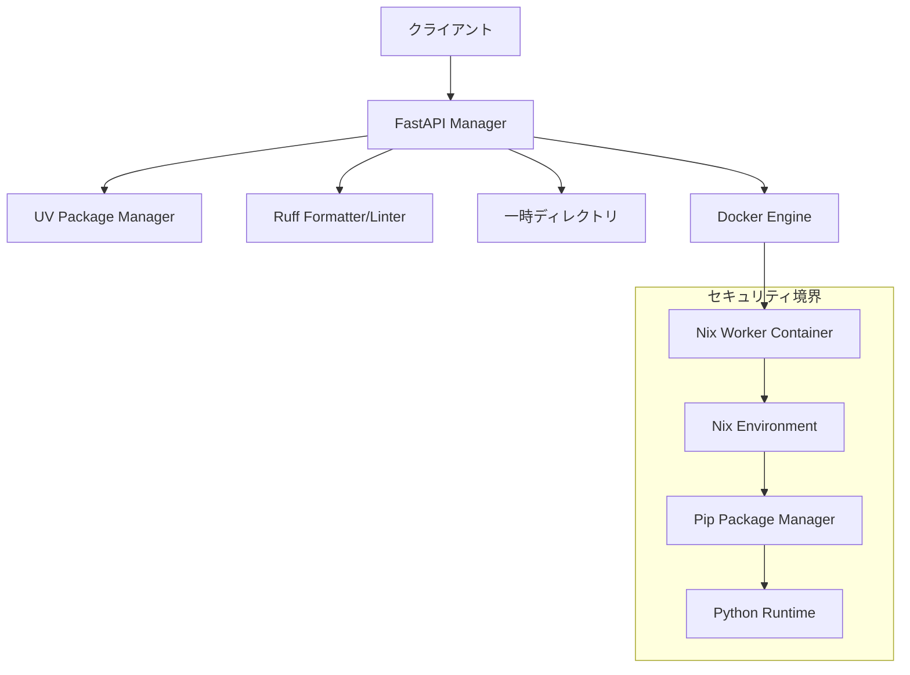

# Design Document

## Overview

Nix環境を使った安全なPythonコード実行システムは、マイクロサービスアーキテクチャを採用し、セキュリティと再現性を重視した設計となっています。システムは管理用のFastAPIサーバーと実行専用のDockerコンテナに分離され、将来的なMCPサーバー統合を考慮した拡張可能な構造を持ちます。

## Architecture



### アーキテクチャの主要コンポーネント

1. **FastAPI Manager**: クライアントリクエストを受け付け、uvとruffによるコード処理、ファイル管理とコンテナオーケストレーションを担当
2. **Nix Worker Container**: 隔離された実行環境でPythonコードを安全に実行
3. **Temporary File System**: 実行用ファイルの一時保存とクリーンアップ
4. **Security Layer**: コンテナレベルでの権限制限とリソース制御

## Components and Interfaces

### FastAPI Manager Component

**責任範囲:**
- HTTPリクエストの受付とレスポンス生成
- ファイルアップロードの処理と検証
- uvとruffによるコードフォーマットとリンティング
- Dockerコンテナの起動と管理
- 実行結果の集約と返却

**主要インターフェース:**
```python
class CodeExecutionManager:
    async def execute_code(
        self, 
        requirements: UploadFile, 
        code: UploadFile
    ) -> ExecutionResult
    
    def _format_code_with_ruff(self, code: str) -> str
    def _lint_code_with_ruff(self, code: str) -> List[str]
    def _install_dependencies_with_uv(self, requirements: str) -> None
    def _create_temp_directory(self) -> str
    def _save_files(self, temp_dir: str, files: dict) -> None
    def _run_container(self, temp_dir: str) -> subprocess.CompletedProcess
    def _cleanup_temp_directory(self, temp_dir: str) -> None
```

### Nix Worker Container Component

**責任範囲:**
- Nix環境でのPython環境構築
- pipを使用したパッケージインストール
- 安全なコード実行と結果収集

**主要インターフェース:**
```bash
# エントリーポイントスクリプト
./run.sh <requirements_path> <code_path>

# 内部処理フロー
setup_nix_environment()
install_packages_with_pip()
execute_python_code()
```

### Security Component

**責任範囲:**
- コンテナレベルでの権限制限
- ネットワークアクセス制御
- リソース使用量制限
- 実行時間制限

**セキュリティ設定:**
```yaml
security_config:
  user: non-root
  network: none
  timeout: 10s
  memory_limit: 512MB
  cpu_limit: 0.5
  read_only_filesystem: true
```

## Data Models

### ExecutionRequest
```python
class ExecutionRequest(BaseModel):
    requirements_content: str
    code_content: str
    timeout: Optional[int] = 10
    format_code: Optional[bool] = True
    lint_code: Optional[bool] = True
```

### ExecutionResult
```python
class ExecutionResult(BaseModel):
    stdout: str
    stderr: str
    return_code: int
    execution_time: float
    formatted_code: Optional[str] = None
    lint_warnings: Optional[List[str]] = None
    success: bool
```

### ContainerConfig
```python
class ContainerConfig(BaseModel):
    image: str = "nix-python-worker"
    timeout: int = 10
    memory_limit: str = "512m"
    cpu_limit: str = "0.5"
    network_mode: str = "none"
    user: str = "1000:1000"
```

## Error Handling

### エラー分類と処理戦略

1. **ファイルアップロードエラー**
   - 不正なファイル形式
   - ファイルサイズ制限超過
   - HTTPステータス: 400 Bad Request

2. **環境構築エラー**
   - requirements.txt解析失敗
   - パッケージインストール失敗
   - HTTPステータス: 422 Unprocessable Entity

3. **実行時エラー**
   - Pythonコード実行エラー
   - タイムアウト
   - HTTPステータス: 200 OK (実行結果として返却)

4. **システムエラー**
   - Dockerコンテナ起動失敗
   - 一時ディレクトリ作成失敗
   - HTTPステータス: 500 Internal Server Error

### エラーレスポンス形式
```python
class ErrorResponse(BaseModel):
    error: str
    detail: str
    error_code: str
    timestamp: datetime
```

## Testing Strategy

### 単体テスト
- FastAPIエンドポイントのテスト
- ファイル処理ロジックのテスト
- エラーハンドリングのテスト

### 統合テスト
- コンテナ起動から実行完了までのフルフロー
- 様々なrequirements.txtパターンでのテスト
- セキュリティ制限の動作確認

### セキュリティテスト
- 悪意のあるコードの実行テスト
- リソース制限の動作確認
- ネットワークアクセス制限の確認

### パフォーマンステスト
- 同時実行時の負荷テスト
- メモリ使用量の監視
- 実行時間の測定

## Deployment Architecture

### Docker Compose構成
```yaml
services:
  fastapi-manager:
    build: ./manager
    ports:
      - "8000:8000"
    volumes:
      - /var/run/docker.sock:/var/run/docker.sock
    environment:
      - WORKER_IMAGE=nix-python-worker
  
  # Worker containerは動的に起動されるため、
  # compose定義には含めない
```

### コンテナイメージ戦略
1. **Manager Image**: FastAPI + Docker client + uv + ruff
2. **Worker Image**: Nix + Python + pip

### スケーリング考慮事項
- Workerコンテナの並列実行制限
- 一時ディレクトリの容量管理
- コンテナイメージのキャッシュ戦略

## Future MCP Integration

### MCP対応のための設計考慮事項

1. **プロトコル変換層**
   - FastAPIエンドポイントからMCPハンドラーへの変換
   - リクエスト/レスポンス形式の標準化

2. **ツール定義**
```python
mcp_tools = {
    "execute_python": {
        "description": "Execute Python code in isolated Nix environment",
        "parameters": {
            "requirements": {"type": "string"},
            "code": {"type": "string"}
        }
    }
}
```

3. **拡張性**
   - 他言語ランタイムの追加
   - カスタムNix環境の対応
   - 実行結果のストリーミング対応