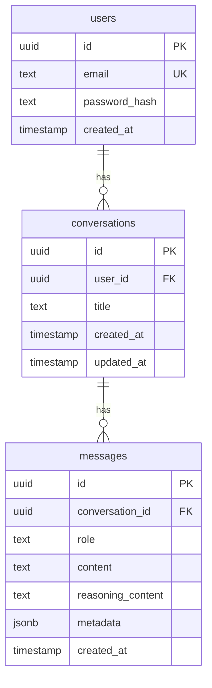

# DB Schema

## Why

`schema.ts` の構造をコードを読まずに把握できるようにし、テーブル間の関係を素早く共有するためです。

## What

- `src/db/schema.ts` と対応するERDを残す
- テーブル定義と主なカラム、リレーションを俯瞰できるようにする

## Constraints

- `schema.ts` の現状定義に合わせる
- マークダウン内にMermaid形式で記述する

## ERD

## Fields

### `users`

| カラム          | 型          | 必須 | 説明                               |
| --------------- | ----------- | ---- | ---------------------------------- |
| `id`            | `uuid`      | Yes  | ユーザーを一意に識別するID         |
| `email`         | `text`      | Yes  | ログインや識別に使うメールアドレス |
| `password_hash` | `text`      | No   | パスワードハッシュ                 |
| `created_at`    | `timestamp` | Yes  | ユーザー作成日時                   |

### `conversations`

| カラム       | 型          | 必須 | 説明                             |
| ------------ | ----------- | ---- | -------------------------------- |
| `id`         | `uuid`      | Yes  | 会話を一意に識別するID           |
| `user_id`    | `uuid`      | Yes  | 会話の所有ユーザーを指す外部キー |
| `title`      | `text`      | No   | 会話タイトル                     |
| `created_at` | `timestamp` | Yes  | 会話作成日時                     |
| `updated_at` | `timestamp` | Yes  | 会話更新日時                     |

### `messages`

| カラム              | 型          | 必須 | 説明                             |
| ------------------- | ----------- | ---- | -------------------------------- |
| `id`                | `uuid`      | Yes  | メッセージを一意に識別するID     |
| `conversation_id`   | `uuid`      | Yes  | 所属する会話を指す外部キー       |
| `role`              | `text`      | Yes  | メッセージ送信者の役割           |
| `content`           | `text`      | Yes  | 表示用の本文                     |
| `reasoning_content` | `text`      | Yes  | 推論過程や補助情報を保持する本文 |
| `metadata`          | `jsonb`     | Yes  | 追加情報を保持するJSON           |
| `created_at`        | `timestamp` | Yes  | メッセージ作成日時               |
