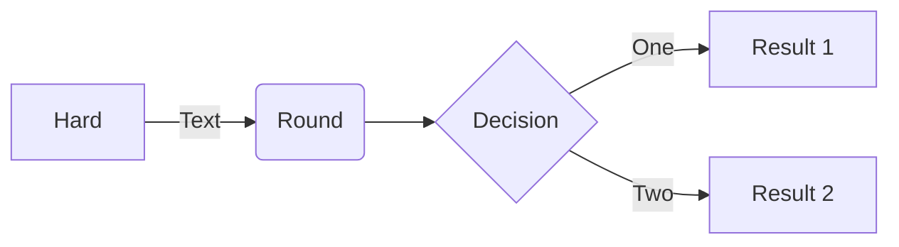
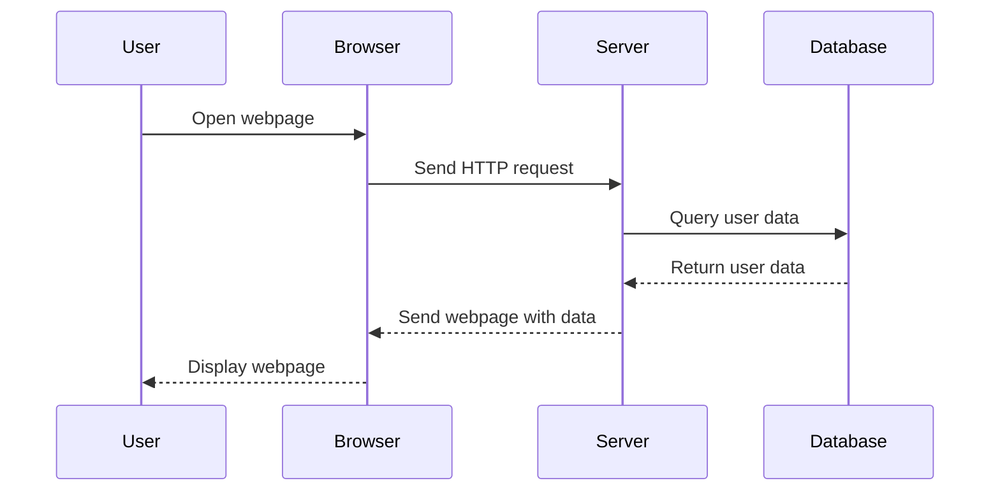
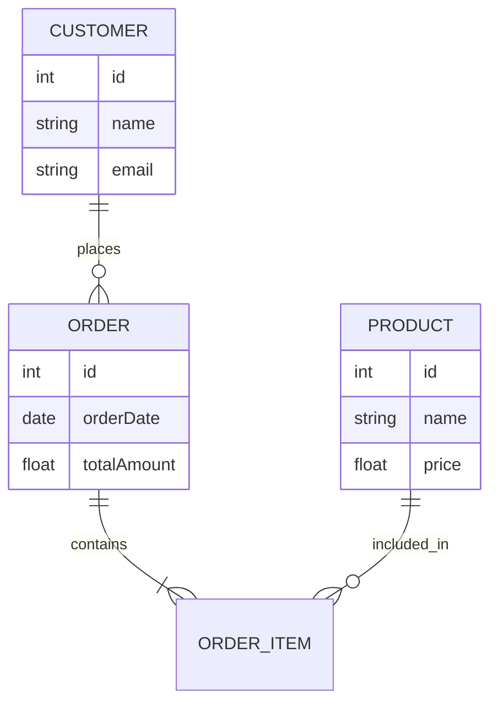

これはテスト用のテキスト文字列です🤖

---

# 見出し1
## 見出し2
### 見出し3
#### 見出し4
##### 見出し5

これは通常のテキストです。

こちらは一般的に私たちが日常的に使う、いわゆる普通の文章、つまり通常のテキストとして知られているものであり、特別な装飾や特殊な表現を用いず、ごく一般的に、誰もが理解しやすい簡潔かつ明瞭な言葉遣いで書かれているものである一方で、その内容は単に単純な情報を伝えるだけにとどまらず、多くの読者にとって分かりやすく、親しみやすく、また場合によってはさらなる説明や補足を加えることで、文章全体の長さや文字数を増やし、情報の密度や表現の豊かさを高める工夫が施されているため、結果として、こうした一つの文章は単なる普通のテキストというだけでなく、その背景にある意図や目的に応じて、詳細な説明や修飾を加えることによって、より長く、読み応えのある、内容の濃い文章へと変貌を遂げることが可能となるわけです。

これは文字列の中に改行コード→\n←があります。

これは文字列の中に改行要素→<br/>←があります。

空白 全角　whitespace&nbsp;空白

**太字テキスト**

*斜体テキスト*

~~取り消し線テキスト~~

- リスト項目1
- リスト項目2
    - ネストされたリスト項目1
    - ネストされたリスト項目2
- リスト項目3

1. 番号付きリスト項目1
2. 番号付きリスト項目2
    1. ネストされた番号付きリスト項目1
    2. ネストされた番号付きリスト項目2
3. 番号付きリスト項目3

> これは引用です。
> 複数行に渡る引用の例です。

`インラインコード`

#### コードブロックです。

```
コードブロックです。
複数行にわたることもできます。
```

#### 横に長いインラインコードです。

```
Dear Team,

Thank you all for your hard work and dedication these past months. Despite challenges, your resilience has been inspiring. Let’s keep supporting each other and communicating openly. Together, we can achieve great success. I appreciate your efforts and look forward to a productive future.

Best regards,
john doe
```

aaaaaaaaaaaaaaaaaaaaaaaaaaaaaaaaaaaaaaaaaaaaaaaaaaaaaaaaaaaaaaaaaaaaaaaaaaaaaaaaaaaaaaaaaaaaaaaaaaaaaaaaaaaaaaaaaaaaaaaaaaaaaaaaaaaaaaaaaaaaaaaaaaaaaaaaaaaaaaaaaaaaaaaaaaaaaaaaaaaaaaaaaaaaaaaaaaaaaaaaaaaaaaaaaaaaaaaaaaaaaaaaaaaaaaaaaaaaaaaaaaaaaaaaaaaaaaaaaaaaaaaaaaaaaaaaaaaaaaaaaaaaaa

#### リンクです。

1. 通常リンク

    [example](https://example.com)

1. アンカーリンク

    [見出し1へ](#見出し1)

1. 自動リンク

    https://www.google.com

1. メールリンク

    <mailto:example@example.com>

#### 画像です。

1. マークダウン形式

    

1. imgタグ形式

    

---

#### テーブルの例です。

| 名前       | 説明                              | 備考                   |
|------------|---------------------------------|------------------------|
| 商品A      | 価格は1000円<br>送料無料         | 使用方法は `簡単`          |
| 商品B      | 在庫あり<br>発送まで2日          | 注意事項は `要確認`          |
| 商品C      | レビュー多数<br>人気商品          | 評価は `高評価`            |

#### mermaid形式です。

1. フローチャート図の例



2. シーケンス図の例



3. ERD（エンティティリレーションシップ図）の例



#### Pythonのコードブロックです。

```python
def hello():
    output = "Hello, World!"
    print(output)

if __name__ == "__main__":
    hello()
```

#### TypeScriptのコードブロックです。

```ts
interface Person {
  name: string;
  age: number;
  isStudent: boolean;
}
```
