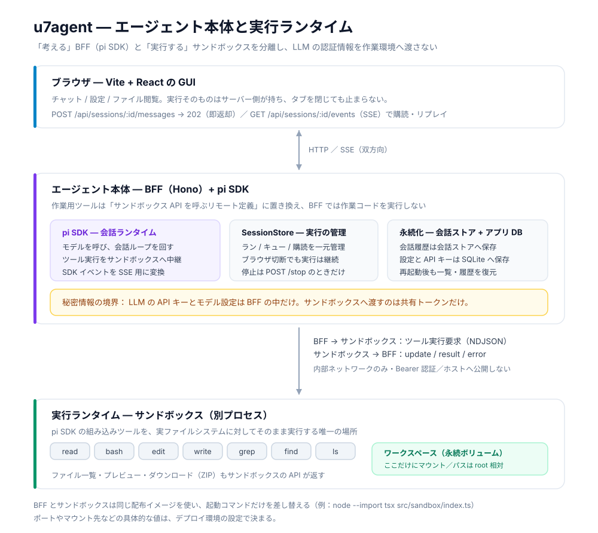

# u7agent

pi SDK を BFF に埋め込んだ小さなブラウザ GUI（`projects/u7agent`）。client は Vite + React 19 + TypeScript + Tailwind CSS v4、BFF は Hono + TypeScript で、client は `hono/client` で型安全に API を呼びます。セッションは BFF 専用の会話ストア（`PI_SESSION_STORE`）へ保存され、再起動後も一覧・履歴・続きの送信を復元できます。エージェント/スキル定義とプロジェクトはアプリデータの SQLite（`<PI_SESSION_STORE>/u7agent.db`）へ保存され、再起動後も残ります。

メッセージ送信は即時に返り、エージェントはバックグラウンドで動き続けます（ブラウザを閉じても継続）。作業用ツール（read / bash / edit / write / grep / find / ls）は BFF から分離したサンドボックスプロセスで実行します。



エージェント本体（BFF + pi SDK）が会話と判断を持ち、実際の作業はサンドボックスが行います。LLM の API キーは本体の内側で止まり、サンドボックスへは共有トークンだけを渡します。ポートやマウント先の具体値はデプロイ環境ごとに決まるため、図には含めていません。

設計の全体像は [docs/architecture.md](docs/architecture.md)、変更テーマ別の入口は [docs/README.md](docs/README.md) にあります。

## ローカルで起動する（Docker なし）

Node.js 24 と pnpm 10.34.5 を使います。初回だけ `pnpm install`。

```bash
pnpm dev   # サンドボックス + BFF + Vite をまとめて起動 → http://localhost:3000
```

- サンドボックスは常に別プロセスです。`pnpm dev` が共有トークンを生成してサンドボックスと BFF の両方へ渡します（ローカルで Docker は不要）
- 作業領域は既定でこのディレクトリです。変えるときは `PI_APP_CWD=/path/to/project pnpm dev`（プロジェクト登録と未所属チャットの起点になります）
- **Linux と Landlock ABI 3 以上（カーネル 6.2 以上）が必要です。** `bash` は書き込みを作業ディレクトリ・共通スキル・`/tmp`・ホーム配下のキャッシュへ限るため、満たさない環境（macOS、古いカーネル）では `bash` を実行できません。ラッパーは `pnpm dev` が `$HOME/.local/libexec/u7agent` へ配置します（許可 root の外に置き、エージェントに書き換えられないようにするため）
- APIキーは起動後に **設定 → モデル** から登録できます（アプリのデータベースに保存され、再起動後も使われます）。`~/.pi/agent/auth.json` があれば不要です
- 停止は Ctrl-C（3 プロセスまとめて止まります）

## 機能

- **プロジェクトとセッションの作業ディレクトリ** — 登録したプロジェクトのセッションはそのディレクトリを cwd にし、未所属チャットは `<workspace root>/.u7agent/sessions/<id>` のスクラッチで動きます（[docs/projects.md](docs/projects.md)）
- **ファイルの持ち出し（ダウンロード）** — 設定 → ファイル と右パネルのツリーの行から、ファイルは元の名前のまま生バイトで、フォルダは ZIP で保存できます。除外規則と上限は [docs/file-preview.md](docs/file-preview.md#ダウンロード)
- **スキル** — エージェント定義スキル / ファイルスキル（`.agents/skills`）/ 組み込みスキルの 3 種類があり、入力欄から `/skill:<name>` で展開します（[docs/persistence.md](docs/persistence.md#スキルの扱い) / [docs/api-catalog.md](docs/api-catalog.md#ファイルスキルagentsskills)）
- **サービス（serve）** — エージェントが起動した Web サーバーを別タブで開き、トップバーから起動・停止・入れ替えができます（[docs/sandbox.md](docs/sandbox.md#serveサービスの公開と起動停止)）
- **通知（Discord）** — 会話ごとのトグルが On のとき、応答の先頭 200 文字を 1 通送ります。機微な会話では Off にしてください（[docs/notifications.md](docs/notifications.md)）

## 環境変数

設定できる変数の一覧と説明は [.env.example](.env.example) が正です（`cp .env.example .env` で読み込まれ、`.env` を読むのは BFF だけ）。サンドボックス側は [docs/sandbox-api.md](docs/sandbox-api.md)、BFF の待受とオリジンの契約は [docs/api.md](docs/api.md) を参照してください。

- **利用可能なモデル**と**アプリ既定モデル**、プロバイダーAPIキーは起動後に **設定 → モデル** から設定するのが既定です（アプリのデータベースへ保存し、再起動せずにモデル候補へ反映します）。選択の入口は GUI に一本化したため、`PI_MODEL` / `PI_MODELS` / `PI_PROVIDER` は読みません（移行は [docs/model-settings.md](docs/model-settings.md)）
- 作業フォルダごとの環境変数（**作業環境 → 環境変数**）は GUI から登録し、**変数**は平文で保存してエージェントの `bash` とサービスの両方から見え、**シークレット**は保存時に暗号化して**サービスの起動時だけ**注入します（エージェントの `bash` の env には入りません。master key は `U7AGENT_SECRET_MASTER_KEY` / `U7AGENT_SECRET_MASTER_KEY_FILE` でアプリ DB とは別経路。値の規則と残存リスクは [docs/secrets.md](docs/secrets.md#作業フォルダの環境変数作業環境--環境変数)）
- ポートを変えると、プレビューの `localStorage` の保存領域も別になります。`pnpm dev` をもう 1 つ並行して起動するときはプレビュー以外のポートも分けてください（[docs/frontend.md](docs/frontend.md#開発フローと配信)）

## セキュリティ

- **ログイン認証はありません。インターネットや LAN へ公開しないでください**（BFF と本番の待受は `127.0.0.1`）。プレビュー オリジン（既定 4318）とサービス オリジン（既定 4319）も無認証で、公開するのは信頼できる閉域 LAN に限ります
- `pnpm dev` の Vite だけは実機確認のため LAN へも待受けます（`0.0.0.0:3000`）。同じ LAN の端末からは認証なしの GUI と `/api`（サンドボックスでの `bash` 実行に到達します）が開けるため、開発用途に限ってください。プレビュー オリジンとサービス オリジンは Vite を通さずブラウザが直接開くため、LAN / 別端末から使うときは `HOST=0.0.0.0` に加えてそれらのポートの到達（WSL2 なら portproxy の追加）が要ります（届かないとプレビューは真っ白になります。[docs/frontend.md](docs/frontend.md#開発フローと配信)）
- ツールはサンドボックスの作業領域でコマンド実行やファイル変更ができます。`write` / `edit` はセッションの作業ディレクトリと `<workspace root>/.agents/skills` に限られ、`bash` とその子プロセスも Landlock でファイルの作成・書き込み・削除・rename・truncate を作業ディレクトリ・共通スキル・`/tmp`・ホーム配下のキャッシュ・デバイスファイルの外側で `EACCES` にします（カーネル 6.2 以上が必要。満たさない環境では `bash` を実行できません）。Landlock は `chmod` / `chown` / `utime` などの属性変更や読み取りまでは制限できないため、信頼できる環境だけで使ってください（[docs/sandbox.md](docs/sandbox.md#残存リスク)）
- LLM の APIキーは BFF が持ち、サンドボックスへは共有トークンしか渡しません。設定 → モデルで登録したキーはアプリデータの SQLite（`PI_SESSION_STORE/u7agent.db`）へ**平文**で保存されるため、DB・WAL・バックアップのアクセス権を管理してください（[docs/model-settings.md](docs/model-settings.md#残存リスク)）。ツール出力に現れた既知のキーは、LLM・SSE・ログへ渡す前に `[REDACTED]` へ置換します
- `pnpm dev` のサンドボックスはホスト上の別プロセスで、BFF と同一ユーザー・同一環境です（親シェルから export した APIキーや、同一ユーザーが読める `~/.pi/agent/auth.json` も見えます）。コンテナ分離の設計と残存リスクは [docs/sandbox.md](docs/sandbox.md) を参照してください
- 作業環境 → 環境変数 の**シークレットだけ**が保存時に暗号化されます（AEAD。プロバイダー / 画像 / Web 検索の APIキー、provider メモ、種別 = 変数の値は `u7agent.db` へ**平文**で残るため、「DB 全体が暗号化された」わけではありません）。シークレットはエージェントの `bash` の env に入りませんが、同一サンドボックス・同一 Unix user でサービスが動くため `/proc/<pid>/environ` などを読める可能性は残ります（[docs/secrets.md](docs/secrets.md#保証範囲と残存リスク)）

## ドキュメント

- [AGENTS.md](AGENTS.md) — エージェント向けのルール（Tech Stack・検証・テスト方針・コメント）
- [docs/README.md](docs/README.md) — 変更テーマ別の索引（ここから必要なドキュメントだけを辿る）

配布イメージは main マージ後の CD が GHCR（`ghcr.io/u7chan/monorepo/u7agent:latest`）へ push します。CD の仕組みは [モノレポのCI/CD](../../docs/about-cicd.md) を参照してください。
